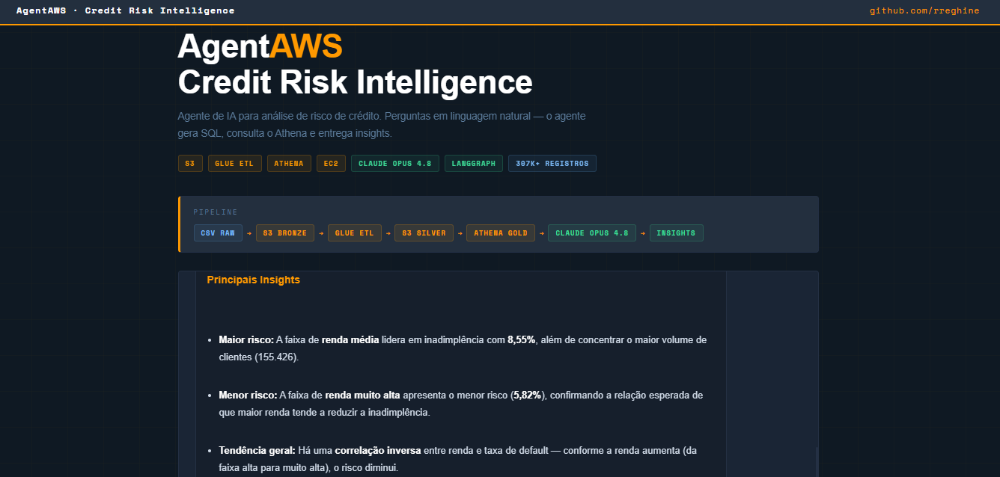

🇺🇸 **English** | [🇧🇷 Português](README.pt-BR.md)

# AgentAWS — Credit Risk Intelligence

> AI agent for natural-language credit risk analysis, built on top of a cloud-native AWS pipeline and Claude Opus 4.8.

---

## Demo



Ask a question in natural language → the agent generates SQL → queries Amazon Athena → returns analytical insights.

**Examples:**
- *"What is the default rate by contract type?"*
- *"Which gender has the highest default risk?"*
- *"Which income range shows the highest default rate?"*

---

## Architecture

```
Raw CSV (Kaggle)
    │
    ▼
S3 Bronze          ← raw data in Parquet
    │
    ▼ S3 Event Notification
    │
AWS Lambda         ← automatic trigger when a new file lands
    │
    ▼ Glue ETL (PySpark)
    │
S3 Silver          ← cleaned and typed data
    │
    ▼ Athena CTAS
    │
S3 Gold            ← aggregated analytical tables
    │
    ▼
LangGraph Agent    ← flow orchestration
    │
    ├── Claude Opus 4.8  ← SQL generation + analysis
    └── Amazon Athena    ← query execution
    │
    ▼
Flask API + HTML Interface (EC2 t3.micro)
```

---

## Stack

| Layer | Technology |
|---|---|
| Data Lake | Amazon S3 (Bronze / Silver / Gold) |
| Cataloging | AWS Glue Crawler + Data Catalog |
| ETL | AWS Glue Jobs (PySpark) |
| Automation | AWS Lambda (S3 → Glue trigger) |
| Query Engine | Amazon Athena (Presto/Trino) |
| AI Agent | LangGraph + Claude Opus 4.8 |
| API | Flask (Python) |
| Deployment | Amazon EC2 t3.micro |
| Dataset | [Home Credit Default Risk](https://www.kaggle.com/c/home-credit-default-risk) |

---

## Dataset

**Home Credit Default Risk** — Kaggle

| Table | Records |
|---|---|
| application_train | 307,511 |
| application_test | 48,744 |
| bureau | 1,716,428 |
| bureau_balance | 27,299,925 |
| credit_card_balance | 3,840,312 |
| installments_payments | 13,605,401 |
| pos_cash_balance | 10,001,358 |
| previous_application | 1,670,214 |
| **Total** | **~58M records** |

---

## Gold Tables

Created via Athena CTAS from the Silver layer:

| Table | Description |
|---|---|
| `gold_default_by_contract` | Default rate by contract type |
| `gold_default_by_gender` | Default rate by gender |
| `gold_default_by_income_range` | Default rate by income range |
| `gold_bureau_features` | Aggregated credit history features |
| `gold_credit_features` | Aggregated credit card features |
| `gold_installments_features` | Aggregated installment features |
| `gold_previous_application_features` | Previous application features |

---

## Automation with Lambda

An AWS Lambda function monitors the S3 Bronze bucket via S3 Event Notification. When a new file arrives, it automatically triggers the Glue ETL job — removing the need to run the pipeline manually.

```
New file → S3 Bronze → S3 Event → Lambda → Glue ETL → Silver updated
```

---

## Key Insights

- **Overall default rate:** 8.1%
- **Cash loans** show an 8.35% default rate vs 5.48% for Revolving loans
- **Men** show a 10.14% default rate vs 7.00% for women
- **Middle income** leads in defaults (8.55%) — higher than the low-income range
- **Very high income** carries the lowest risk: 5.82%

---

## Project Structure

```
agentaws/
├── src/
│   ├── agent.py        # LangGraph agent (CLI)
│   └── app.py          # Flask API + HTML route
├── index.html          # Web interface
├── .env                # Environment variables (not versioned)
├── requirements.txt
└── README.md
```

---

## Agent Flow

```
Question (natural language)
        │
        ▼
  generate_sql        ← Claude Opus 4.8 generates SQL from the schema
        │
        ▼
  run_query           ← Executes on Amazon Athena via PyAthena
        │
        ▼
  generate_answer     ← Claude Opus 4.8 analyzes the data and generates the insight
        │
        ▼
  Answer with analysis and recommendations
```

---

## Author

**Rafael Reghine Munhoz** — Analytics Engineer

- LinkedIn: [linkedin.com/in/rafaelreghine](https://linkedin.com/in/rafaelreghine)
- GitHub: [github.com/rreghine](https://github.com/rreghine)
- MBA in Data Science & Analytics — USP (University of São Paulo)
